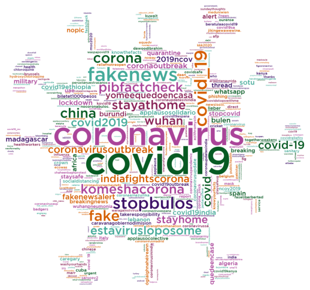

# Hashtag word clouds - Fake Covid-19 dataset

In order to create the word clouds, we need the following packages:


```python
import pandas as pd
import numpy as np
import json
import sys
import string
import re
from wordcloud import WordCloud, STOPWORDS
import matplotlib.pyplot as plt 
import nltk
from PIL import Image
import itertools
import altair as alt
from matplotlib.colors import ListedColormap
```

To read the JSON file that has all the tweets, it is necessary to do:


```python
data = []
with open('dataset/fakecovid_result_final_translated_full.json', 'r') as f:
    for line in f:
        data.append(json.loads(line))
```

## Terms regarding Covid

We have filtered all the hashtags and then we have calculated the frequency distribution:


```python
index_covid=0
cmt_list_covid = []
for element in data:
    for entity in data[index_covid]['entities']['hashtags']:
        entity['text'] = entity['text'].lower()
        entity['text'] = entity['text'].replace(" ", "")
        token_covid=entity['text']
        cmt_list_covid.append(token_covid)
        
    index_covid=index_covid+1
    
fdist_covid = dict(nltk.FreqDist(cmt_list_covid))
```

The hashtag word cloud is generated:


```python
mask_covid= np.array(Image.open('grafici/covid.jpg'))

a = ['#3C1067', '#075A23', '#44AA99', '#D55E00', '#AA4499', '#882255']
my_cmap = ListedColormap(a)

wordcloud_covid = WordCloud(
                    mask=mask_covid,
                    width=mask_covid.shape[1],
                    height=mask_covid.shape[0],
                    background_color ='white', 
                    min_word_length = 3,
                    max_words=500,
                    font_path = 'grafici/GothamMedium.ttf',
                    colormap=my_cmap).generate_from_frequencies(fdist_covid)
```

Plot the hashtag word cloud (WITH terms regarding Covid):


```python
# Plot the word cloud image                        
plt.figure(figsize = (7, 7), facecolor = None) 
plt.imshow(wordcloud_covid) 
plt.axis("off") 
plt.tight_layout(pad = 0) 
#plt.show()
```



## Terms not regarding Covid

We have also filtered all the hashtags without terms regarding Covid and then have calculated the frequency distribution:


```python
index=0
cmt_list = []
stopwords = ["covid-19","coronavirusinindia","covidstopswithme","covid19kenya","stopbulos","coronavirusmadrid","coronavirusespana","coronavirusesp","waspapovid19","covidfriday","cov19","coronavirusreachesdelhi","covid19ethiopia","covidsafe","covid19espana","nocoronabulos.","nocoronabulos","covid19sa","coronaupdatesindia","beratulaacovid19","coronaainazuilika","corona_snick","kovid19","yomeequedoencasa","coronaupdatesinindia","quedeencase","covid19outbreak","covidreliefirs","stopcovid","stayathome","komeshacorona","mask","wuhan","estavirusloposome","waragainstvirus","staysafe","stayhome","influenza","chloroquine","staysafeug","socialdistancing","hydroxychloroquine","wuhanpneumonia","washyourhands","masks","coronawarriors","covid19australia","vaccine","coronacrisis","coronaviruskenya","covidiots","covid19uk","lockdownsa","covidiot","chinesevirus","pandemic","coronaviruslockdown","quarantinelife","sarscov2","coronalockdown","coronaupdate","covid19us","nomeat_nocoronavirus","covid19india","coronavirusupdate","quarantine","lockdown","chinavirus","coronaviruschina","coronavirusuk","wuhanvirus","coronavirusupdates","covid19pandemic","coronavirususa","covid19nigeria","coronaviruschina","coronarvirus","coronaoutbreak","ncov2019","2019ncov","chinacoronavirus","coronavirussa","wuhancoronavirus","coronarovirus","indiafightscorona","covid19", "coronavirus", "corona", "covid_19", "covid","coronavirusoutbreak","covid2019", "virus", "covid__19","covid19aus", "coronavirusindia","covidー19", "coronaviruspandemic"]
for element in data:
    for entity in data[index]['entities']['hashtags']:
        entity['text'] = entity['text'].lower()
        entity['text'] = entity['text'].replace(" ", "")
        if entity['text'] not in stopwords:
            token=entity['text']
            cmt_list.append(token)
        
    index=index+1
    
fdist_hashtag = dict(nltk.FreqDist(cmt_list))
```

The hashtag word cloud is generated:


```python
mask_nocovid= np.array(Image.open('grafici/speech_bubble.jpg'))

a = ['#3C1067', '#075A23', '#44AA99', '#D55E00', '#AA4499', '#882255']
my_cmap = ListedColormap(a)

wordcloud_nocovid = WordCloud(
                        mask=mask_nocovid,
                        width=mask_nocovid.shape[1],
                        height=mask_nocovid.shape[0],
                        background_color ='white', 
                        min_word_length = 3,
                        font_path = 'grafici/GothamMedium.ttf',
                        min_font_size = 10,
                        colormap=my_cmap).generate_from_frequencies(fdist_hashtag)
```

Plot the hashtag word cloud (WITHOUT terms regarding Covid):


```python
# Plot the word cloud image                      
plt.figure(figsize = (8, 8), facecolor = None) 
plt.imshow(wordcloud_nocovid) 
plt.axis("off") 
plt.tight_layout(pad = 0) 
#plt.show() 
```


