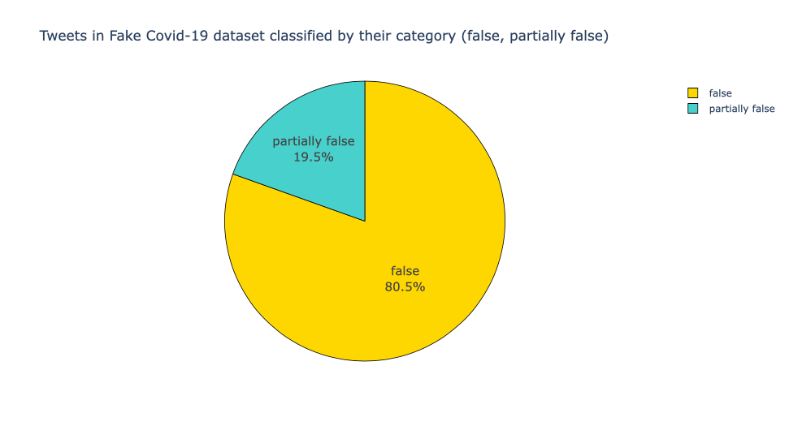

# Tweets in Fake Covid-19 dataset classified by their category (false, partially false) - Pie chart 

The goal is to visualize a pie chart with the classification of the tweets by their category, so we need the following libraries:


```python
import plotly.express as px
import json
import pandas as pd
import csv
import itertools
from collections import Counter
```

For the classification purposes we need to read the csv then the json:


```python
csv_dataframe = pd.read_csv('dataset/FINAL_fakecovid_final_filtered_dataset_clean.csv',sep=";")
csv_dataframe['tweet_id'] = csv_dataframe['tweet_id'].astype(str)
csv_list = csv_dataframe.values.tolist()
lista_unica_csv=list(itertools.chain.from_iterable(csv_list))

data = []
with open('dataset/fakecovid_result_final_translated_full.json', 'r') as f:
    for line in f:
        data.append(json.loads(line))
```

We simply read the tweets ID and then memorize their category in a list; from that list we count the 'false' and 'partially false' occurrencies with Counter and then we can create the dataframe for the pie chart:


```python
category = []
index = 0

for element in data:
    token_id = data[index]['id_str']
    indice_csv = lista_unica_csv.index(token_id)
    category.append(lista_unica_csv[indice_csv+1].lower())
    index=index+1

count = Counter(category)

df = pd.DataFrame.from_dict(count, orient='index').reset_index()
df = df.rename(columns={'index':'Category', 0:'Count'})
```

We're ready to visualize the pie chart:


```python
colors = ['gold', 'mediumturquoise']

fig = px.pie(df, values='Count', names='Category',
             title='Tweets in Fake Covid-19 dataset classified by their category (false, partially false)')
fig.update_traces(textposition='inside', textinfo='percent+label', textfont_size=15,
                  marker=dict(colors=colors, line=dict(color='#000000', width=0.8)))
fig.show()
```


