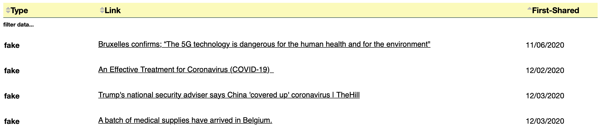
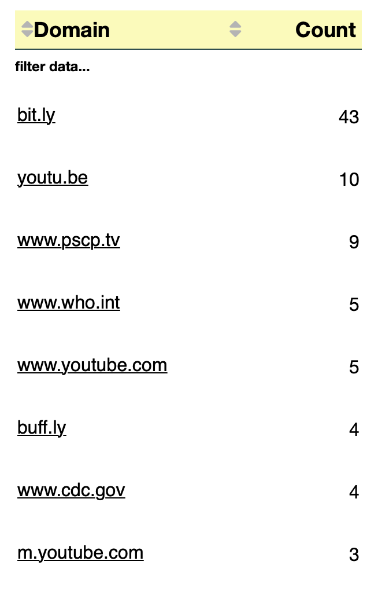

# Tables - Fake Covid-19 dataset

## Tweets Visualization

We've used the following packages to create a table showing the tweets and the relative tweets links:


```python
import itertools
import pandas as pd
import json
from dateutil.parser import parse
import dash
import dash_core_components as dcc
import dash_html_components as html
from dash.dependencies import Input, Output
import dash_table
import re
from jupyter_dash import JupyterDash
import requests
from bs4 import BeautifulSoup
import datetime
from dateutil.parser import parse
from urllib.parse import urlparse
from collections import Counter
import csv
from IPython.core.display import Image, display
```

We've defined a function to remove URLs from the tweet's text:


```python
def remove_urls(text):
    result = re.sub(r"http\S+", "", text)
    return(result)
```

In order to do the classification of the tweets, we need to read the CSV file and the JSON file:


```python
csv_dataframe = pd.read_csv('dataset/FINAL_fakecovid_final_filtered_dataset_clean.csv',sep=";")
csv_dataframe['tweet_id'] = csv_dataframe['tweet_id'].astype(str)
csv_list = csv_dataframe.values.tolist()
lista_unica_csv=list(itertools.chain.from_iterable(csv_list))

data = []
with open('dataset/fakecovid_result_final_translated_full.json', 'r') as f:
    for line in f:
        data.append(json.loads(line))
```

We're going to visualize Tweets and relative links in a table and we will classify them in two categories: "fake" and "partially false".


```python
index= 0

category = []
date = []
txt = []
link = []

for element in data:
    token_id = data[index]['id_str']                          
    indice_csv = lista_unica_csv.index(token_id)   
    value_cat =  lista_unica_csv[indice_csv+1].lower()
    if value_cat == "false":
        value_cat = "fake"
    category.append(value_cat.replace(" ", ""))
    
    token=data[index]['created_at']
    d = parse(token)
    d = d.strftime('%Y/%m/%d')
    date.append(d)
    
    txt.append(remove_urls(data[index]['full_text']))
    link.append("[http://twitter.com/anyuser/status/"+data[index]['id_str']+"](http://twitter.com/anyuser/status/"+data[index]['id_str']+")")
    index=index+1
```

We create the Pandas DataFrame and then we work on it in order to create the table:


```python
df = pd.DataFrame(
    {'Type': category,
    'Date': date,
    'Tweet': txt,
    'Link': link
    })
```

In order to create the table, we've used the Dash module, that allows to generate an interactive table.


```python
app = JupyterDash(__name__)
#https://dash.plotly.com/datatable/filtering
app.layout = html.Div([
    dash_table.DataTable(
        id='datatable-interactivity',
        columns=[
            {'name': 'Type', 'id': 'Type'},
            {'name': 'Date', 'id': 'Date'},
            {'name': 'Tweet', 'id': 'Tweet'},
            {'name': 'Link', 'id':'Link', 'type': 'text', 'presentation':'markdown'}],
        data=df.to_dict('records'),
        style_filter={
            "backgroundColor":"white"
        },
        style_data_conditional=[
        {
            'if': {
                'column_id': 'Type',
            },
            'font-weight':'bold',
            'width':'200px'
        },
        {
            'if': {
                'column_id': 'Date',
            },
            'width':'200px'
        },
        {
            'if': {
                'column_id': 'Tweet',
            },
            'width':'2500px'
        },
        {
            'if': {
                'column_id': 'Link',
            },
            'font-size':'16px'
        }],
        style_cell={
            'textAlign':'left',
            'font-family': 'Helvetica Neue',
            'whiteSpace': 'normal',
            'padding-bottom': '15px',
            'border':'0px solid darkslategray',
            'font-size':'16px',
            'height': 'auto'
        },
        style_header={
            'backgroundColor':"#FBFBB8", #moccasin
            'font-family':'Helvetica Neue',
            'font-weight': 'bold',
            'whiteSpace': 'normal',
            'padding': '10px',
            'border-bottom':'1px solid darkslategray',
            'font-size':'18px',
            'height': 'auto'
        },
        style_data={
            'whiteSpace': 'normal',
            'height': 'auto'
        },
        filter_action="native",
        sort_action="native",
        sort_mode="multi",
        page_action="native",
        page_current= 0,
        page_size= 4,
        fill_width=False
    ),
    html.Div(id='datatable-interactivity-container')
])


#if __name__ == '__main__':
#    app.run_server(debug=False)
app.run_server()#mode='inline'

```


For the "filter data" field, unlike the other table cells, the style was applied using a ***CSS file***:

```
.dash-table-container .dash-spreadsheet-container .dash-spreadsheet-inner input:not([type=radio]):not([type=checkbox]){
    color: black!important;
    text-align: left!important;
    font-family: 'Helvetica Neue'!important;
    font-size: 16px!important;
    padding: 20px!important;
    font-weight: bold!important;
}

a {
    color:black!important;
}
```

## Tweets Insider Links Visualization

### Let's create the Dash DataTable...but first

The generated URLs dataset (urls.csv) (see PreProcessing notebook to get more information about its creation process) contained links that referred to:
- private Tweets, so not publicly visible and considered not relevant
- Tweets of suspended accounts, so no longer available
- deleted Tweets
- web pages no longer available

Thus, we have manually cleaned the dataset by veryfing every single link and by removing those rows that contained these irrilevant links.

### Now we can start

First, we have to read the CSV file:


```python
df = pd.read_csv('dataset/urls.csv',sep=';')
```

Then, we create the Dash DataTable:


```python
app = JupyterDash(__name__)
#https://dash.plotly.com/datatable/filtering
app.layout = html.Div([
    dash_table.DataTable(
        id='datatable-interactivity',
        columns=[{'name': 'Type', 'id':'Type'},
            {'name': 'Link', 'id':'Link', 'type': 'text', 'presentation':'markdown'},
            {'name': 'First-Shared', 'id': 'First-Shared'}],
        data=df.to_dict('records'),
        style_data_conditional=[{
            'if': {
                'column_id': 'Type',
            },
            'font-weight':'bold',
            'width':'200px',
        }],
        style_filter={
            "backgroundColor":"white"
        },
        style_cell={
            'textAlign':'left',
            'font-family': 'Helvetica Neue',
            'border':'0px solid darkslategray',
            'font-size':'16px',
        },
        style_header={
            'backgroundColor':"#FBFBB8", #moccasin
            'font-family':'Helvetica Neue',
            'font-weight': 'bold',
            'border-bottom':'1px solid darkslategray',
            'font-size':'17px',
            'textAlign':'left',
            'padding':'5px'
            
        },
        filter_action="native",
        sort_action="native",
        sort_mode="multi",
        page_action="native",
        page_current= 0,
        page_size= 4,
    ),
    html.Div(id='datatable-interactivity-container')
])


app.run_server(port=8051)
```



## What about the domains?


```python
index=0
domains = []
for element in data:
    #print(index)
    if data[index]['entities']['urls'] is not None:
        for entity in data[index]['entities']['urls']:
            domain = urlparse(entity['expanded_url'].lower()).netloc
            if domain!="twitter.com":
                domains.append("["+domain+"]"+"(http://"+domain+")") #wrap with http:// needed to make the link work
    
    #print(" ")
    index=index+1

count = Counter(domains)
df_d = pd.DataFrame.from_dict(count, orient='index').reset_index()
df_d = df_d.rename(columns={'index':'Domain', 0:'Count'})
df_d = df_d.sort_values(by=['Count'], ascending=False)
df.to_csv('dataset/domains_fake.csv', sep=';', index=False) #for a deeper analysis
```


```python
app = JupyterDash(__name__)
#https://dash.plotly.com/datatable/filtering
app.layout = html.Div([
    dash_table.DataTable(
        id='datatable-domain',
        columns=[
            {'name': 'Domain', 'id':'Domain', 'type': 'text', 'presentation':'markdown'},
            {'name': 'Count', 'id': 'Count'}],
        data=df_d.to_dict('records'),
        style_data_conditional=[{
            'if': {
                'column_id': 'Count',
            },
            'text-align':'right',
            'width':'120px'
        },
        {
            'if': {
                'column_id': 'Domain',
            },
            'text-align':'left',
            'width':'180px'
        }],
        style_header_conditional=[{
            'if': {
                'column_id': 'Count',
            },
            'text-align':'right',
            'width':'120px'
        },
        {
            'if': {
                'column_id': 'Domain',
            },
            'text-align':'left',
            'width':'180px'
        }],
        style_filter={
            "backgroundColor":"white"
        },
        style_cell={
            'font-family': 'Helvetica Neue',
            'border':'0px solid darkslategray',
            'font-size':'16px',
        },
        style_header={
            'backgroundColor':"#FBFBB8", #moccasin
            'font-family':'Helvetica Neue',
            'font-weight': 'bold',
            'border-bottom':'1px solid darkslategray',
            'font-size':'18px',
            'padding':'5px'
        },
        filter_action="native",
        sort_action="native",
        sort_mode="multi",
        page_action="native",
        page_current= 0,
        page_size= 8,
        fill_width=False
    ),
    html.Div(id='datatable-domain-container')
])

app.run_server(mode="inline",port=7773)
```


