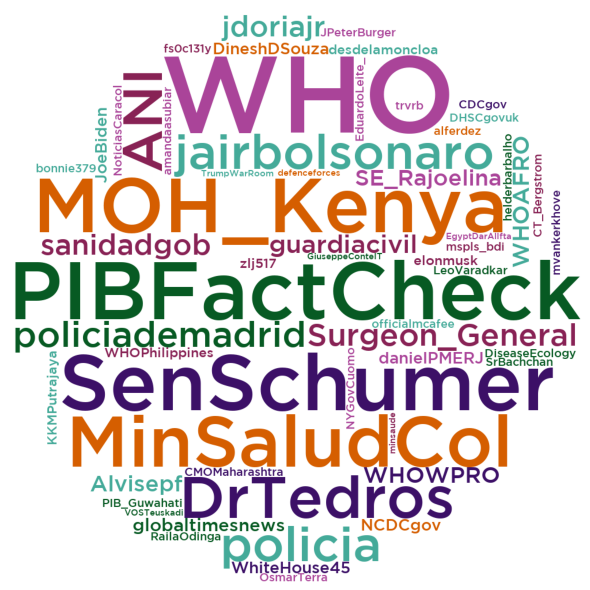
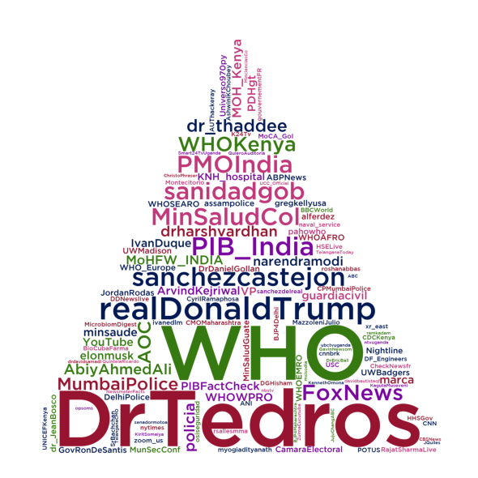

# Users and Mentions  word clouds - Fake Covid-19 Dataset

We've used the following packages:


```python
import pandas as pd
import numpy as np
import json
import itertools  
from wordcloud import WordCloud, STOPWORDS
import matplotlib.pyplot as plt 
import nltk
from PIL import Image
import altair as alt
from matplotlib.colors import ListedColormap
```

To read the JSON file that has all the tweets, it is necessary to do:


```python
data = []
with open('dataset/fakecovid_result_final_translated_full.json', 'r') as f:
    for line in f:
        data.append(json.loads(line))
```

## Users

We have filtered all the users and then we have calculated the frequency distribution:


```python
index_users=0
cmt_list_users = []
for element in data:
    token_users=data[index_users]['user']['screen_name']
    cmt_list_users.append(token_users)
    index_users=index_users+1
    
fdist_users = dict(nltk.FreqDist(cmt_list_users))
```

The users word cloud is created:


```python
mask = np.array(Image.open('grafici/circle.jpg'))

a = ['#3C1067', '#075A23', '#44AA99', '#D55E00', '#AA4499', '#882255']
my_cmapu = ListedColormap(a)

wordcloud = WordCloud(background_color ='white', 
                font_path = 'grafici/GothamMedium.ttf',
                mask=mask,
                width=mask.shape[1],
                height=mask.shape[0],
                min_word_length = 3,
                max_words=400,
                min_font_size = 14,
                colormap=my_cmapu).generate_from_frequencies(fdist_users)
```

Plot the users word cloud:


```python
# Plot the word cloud image                        
plt.figure(figsize = (8, 8), facecolor = None) 
plt.imshow(wordcloud) 
plt.axis("off") 
plt.tight_layout(pad = 0)
#plt.show()
```



As we can see, the users that have more written about COVID-19 are WHO, PIBFactCheck...
<br>This is a strange output...<br>
Unfortunately, we cannot explain why these relevant users' tweets have been classified as "fake" since we aren't the authors of the dataset.

## Mentions

We have also filtered all the mentions and then we have calculated the frequency distribution:


```python
index_mentions=0
cmt_list_mentions = []
for element in data:
    for entity in data[index_mentions]['entities']['user_mentions']:
        token_mentions=entity['screen_name']
        cmt_list_mentions.append(token_mentions)
    index_mentions=index_mentions+1
fdist_mentions = dict(nltk.FreqDist(cmt_list_mentions))
```

The mentions word cloud is created:


```python
mask=np.array(Image.open('grafici/triangle.jpg'))

a = ['#021954', '#357910', '#C1377A', '#7A05A0', '#96142F']
my_cmap = ListedColormap(a)

wordcloud = WordCloud(mask=mask,
            width=mask.shape[1],
            height=mask.shape[0],
            background_color ='white', 
            min_word_length = 3,
            max_words=120,
            font_path = 'grafici/GothamMedium.ttf',
            min_font_size = 15,
            colormap=my_cmap).generate_from_frequencies(fdist_mentions) 
```

Plot the mentions word cloud:


```python
# Plot the word cloud image
plt.figure(figsize = (8, 8), facecolor = None) 
plt.imshow(wordcloud) 
plt.axis("off") 
plt.tight_layout(pad = 0)
#plt.show()
```


