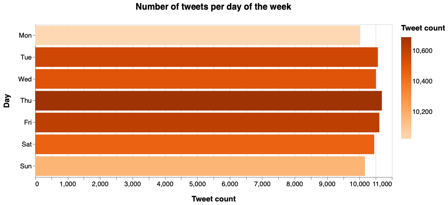
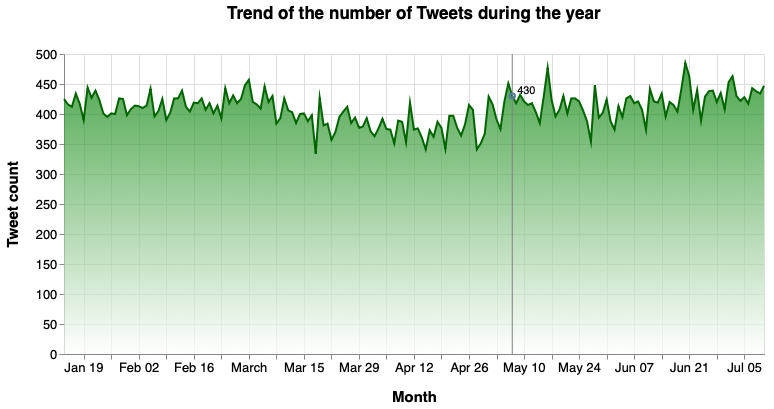

# Dates - General Covid-19 dataset

In order to create the bar and area charts, we need the following packages:


```python
import pandas as pd
import json
from collections import Counter
import altair as alt
from dateutil.parser import parse
```

To read the JSON file that has all the tweets, it is necessary to do:


```python
data = []
with open('dataset/general_result_translated_full.json', 'r') as f:
    for line in f:
        data.append(json.loads(line))
```

## Bar chart: "Number of tweets per day of the week"

We're interested in the "created_at" field:


```python
index = 0
new = []
for element in data:
    token = data[index]['created_at']
    new.append(token[0:3])
    index = index + 1

#print(new)
#print(len(new))

count = Counter(new)
#print(count)
```

The bar chart is created:


```python
df = pd.DataFrame.from_dict(count, orient='index').reset_index()
df = df.rename(columns={'index':'Day',0:'Tweet count'})

chart = alt.Chart(
    df
).mark_bar().encode(
    x = alt.X('Tweet count:Q'),
    y = alt.Y('Day', sort = ['Mon','Tue','Wed','Thu','Fri','Sat','Sun']),
    color=alt.Color('Tweet count:Q',scale=alt.Scale(scheme="oranges")),
    tooltip=[
        alt.Tooltip('Day', title='Day'),
        alt.Tooltip('Tweet count:Q', title='Tweet count')
    ]
).transform_window(
    rank='rank(count)',
    sort=[alt.SortField('count', order='descending')]
).properties(
    width=700,
    height=300,
    title = "Number of tweets per day of the week"
).configure_title(
    fontSize=17,
    offset=25
).configure_axis(
    labelFontSize=13,
    titleFontSize=15,
    titlePadding=15
).configure_legend(
    gradientThickness=20,
    titleFontSize=15,
    labelFontSize=13,
    titlePadding=10
)

chart
```



## Area chart: "Trend of the number of Tweets during the year"

We're interested in the "created_at" field:


```python
index = 0
new = []
for element in data:
    token = data[index]['created_at']
    d = parse(token)
    d = d.strftime('%Y/%m/%d')
    new.append(d)
    index = index + 1

#print(new)
#print(len(new))

count = Counter(new)
#print(count)
```

The area chart is created:


```python
df = pd.DataFrame.from_dict(count, orient='index').reset_index()
df = df.rename(columns={'index':'Month',0:'Tweet count'})
df['Month']= pd.to_datetime(df['Month'])

# Create a selection that chooses the nearest point & selects based on x-value
nearest = alt.selection(type='single', nearest=True, on='mouseover',
                        fields=['Month'], empty='none')


chart = alt.Chart(df).mark_area(
    #point= True,
    line={'color':'#126DC5'},
    color=alt.Gradient(
        gradient='linear',
        stops=[alt.GradientStop(color='white', offset=0),
               alt.GradientStop(color='mediumturquoise', offset=1)],
        x1=1,
        x2=1,
        y1=1,
        y2=0
    )
).properties(
    width=700,
    height=300,
    title = "Trend of the number of Tweets during the year"
).encode(
        #alt.X('Month', sort = ['Jan','Feb','Mar','Apr','May','Jun','Jul']),
        alt.X('Month'),
        alt.Y('Tweet count:Q')
        #tooltip=['Month', 'Tweet count']
)

# Transparent selectors across the chart. This is what tells us
# the x-value of the cursor
selectors = alt.Chart(df).mark_point().encode(
    #x=alt.X('Month', sort = ['Jan','Feb','Mar','Apr','May','Jun','Jul']),
    x=alt.X('Month'),
    opacity=alt.value(0),
).add_selection(
    nearest
)

# Draw points on the line, and highlight based on selection
points = chart.mark_point().encode(
    opacity=alt.condition(nearest, alt.value(1), alt.value(0))
)

# Draw text labels near the points, and highlight based on selection
text = chart.mark_text(align='left', dx=5, dy=-5).encode(
    text=alt.condition(nearest, 'Tweet count:Q', alt.value(' '))
)

# Draw a rule at the location of the selection
rules = alt.Chart(df).mark_rule(color='gray').encode(
    #x=alt.X('Month', sort = ['Jan','Feb','Mar','Apr','May','Jun','Jul']),
    x=alt.X('Month'),
).transform_filter(
    nearest
)

# Put the five layers into a chart and bind the data
alt.layer(
    chart, selectors, points, rules, text
).properties(
    width=700,
    height=300
).configure_title(
    fontSize=17,
    offset=25
).configure_axis(
    labelFontSize=13,
    titleFontSize=15,
    titlePadding=15
)
```


