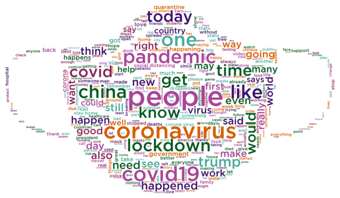

# Text word clouds - General Covid-19 dataset 

In order to create the word clouds, we need the following packages:


```python
import pandas as pd
import numpy as np
import json
import string
import re
from emot.emo_unicode import UNICODE_EMO, EMOTICONS
import emoji
from wordcloud import WordCloud, STOPWORDS
import matplotlib.pyplot as plt 
from PIL import Image
import nltk
from nltk.corpus import stopwords
import itertools
import altair as alt
from matplotlib.colors import ListedColormap

alt.data_transformers.disable_max_rows()
```

Then we have defined the following functions to clean the tweets' text:


```python
def remove_emoticons(text):
    emoticon_pattern = re.compile(u'(' + u'|'.join(k for k in EMOTICONS) + u')')
    return emoticon_pattern.sub(r'', text)

def remove_emoji(text):
    emoji_pattern = re.compile("["
                           u"\U0001F600-\U0001F64F"  # emoticons
                           u"\U0001F300-\U0001F5FF"  # symbols & pictographs
                           u"\U0001F680-\U0001F6FF"  # transport & map symbols
                           u"\U0001F1E0-\U0001F1FF"  # flags (iOS)
                           u"\U00002702-\U000027B0"
                           u"\U000024C2-\U0001F251"
                           "]+", flags=re.UNICODE)
    return emoji_pattern.sub(r'', text)

def remove_urls(text):
    result = re.sub(r"http\S+", "", text)
    return(result)

def remove_twitter_urls(text):
    clean = re.sub(r"pic.twitter\S+", "",text)
    return(clean)

def give_emoji_free_text(text):
    return emoji.get_emoji_regexp().sub(r'', text)

def noamp(text):
    clean = re.sub("&amp", " ",text)
    return (clean)
```

To read the JSON file that has all the tweets, it is necessary to do:


```python
data = []
with open('dataset/general_result_translated_full.json', 'r') as f:
    for line in f:
        data.append(json.loads(line))
data1 = data
```

## Terms regarding Covid

We're interested in the "full_text" field, that it has been cleaned with specific functions:


```python
index=0
comment_words = ''
stop_words = stopwords.words('english')
for element in data:
    data[index]['full_text'] = data[index]['full_text'].lower()                   # Put everything in lowercase
    #data[index]['full_text'] = contractions.fix(data[index]['full_text'])
    data[index]['full_text'] = re.sub("\'\w+", '', data[index]['full_text'])      # Remove everything after '
    data[index]['full_text'] = remove_urls(data[index]['full_text'])
    data[index]['full_text'] = remove_twitter_urls(data[index]['full_text'])
    data[index]['full_text'] = remove_emoticons(data[index]['full_text'])
    data[index]['full_text'] = remove_emoji(data[index]['full_text'])
    data[index]['full_text'] = give_emoji_free_text(data[index]['full_text'])
    data[index]['full_text'] = noamp(data[index]['full_text'])                    # No amp with space
    data[index]['full_text'] = re.sub("#\S+", " ",  data[index]['full_text'])     # Remove hashtags
    data[index]['full_text'] = re.sub("@\S+", " ",  data[index]['full_text'])     # No mentions
    data[index]['full_text'] = data[index]['full_text'].translate(str.maketrans('', '', string.punctuation)) # No puntuaction
    data[index]['full_text'] = data[index]['full_text'].encode('ascii', 'ignore').decode() # No unicode
    data[index]['full_text'] = re.sub("^rt ", " ", data[index]['full_text'])      # No RT
    data[index]['full_text'] = re.sub('\s{2,}', " ", data[index]['full_text'])    # Remove big spaces

    
    tokens=data[index]['full_text'].split()

    comment_words += " ".join(tokens)+" "
    index=index+1
```

Then the word cloud is created:


```python
mask_covid= np.array(Image.open('grafici/face_mask.jpg'))

a = ['#3C1067', '#075A23', '#44AA99', '#D55E00', '#AA4499', '#882255']
my_cmap = ListedColormap(a)

wordcloud_covid = WordCloud(background_color ='white',
            mask=mask_covid,
            width=mask_covid.shape[1],
            height=mask_covid.shape[0],
            stopwords = stop_words,
            normalize_plurals=False,
            min_word_length = 3,
            max_words=400,
            font_path = 'grafici/GothamMedium.ttf',
            min_font_size = 14,
            colormap=my_cmap).generate(comment_words)
```

Plot the word cloud (WITH terms regarding Covid):


```python
# Plot the word cloud image
plt.figure(figsize = (9, 9), facecolor = None) 
plt.imshow(wordcloud_covid,interpolation="bilinear") 
plt.axis("off") 
plt.tight_layout(pad = 0)
plt.show() 
```



We have created a bar chart showing the 10 most used words within the dataset:


```python
out = wordcloud_covid.process_text(comment_words)
#print(distribuzione)
#fdist_sorted = dict(sorted(distribuzione.items(), key=lambda item: item[1], reverse=True))
#print(fdist_sorted)
#out = dict(itertools.islice(fdist_sorted.items(), 15))

df = pd.DataFrame.from_dict(out, orient='index').reset_index()
df = df.rename(columns={'index':'Words', 0:'Count'})
#print(df)
#alt.renderers.enable('altair_viewer',inline=True)

#range=['#eddafe','#e1c1fe','#c990ff','#b15fff','#992eff','#8100fc','#6800cc','#4f009b','#36006a','#1d0039']

chart = alt.Chart(
    df
).mark_bar().encode(
    x=alt.X('Count:Q'),
    y=alt.Y('Words:N',sort='-x'),
    color=alt.Color('Count:Q',scale=alt.Scale(scheme="blues")),
    tooltip=[
        alt.Tooltip('Words:N', title='Word'),
        alt.Tooltip('Count:Q', title='Tweet count')
    ]
).transform_window(
    rank='rank(Count)',
    sort=[alt.SortField('Count', order='descending')]
).transform_filter(
    (alt.datum.rank <= 10)
).properties(
    width=700,
    height=300,
    title = "The 10 most frequent words (Covid related) in the dataset"
).configure_title(
    fontSize=17,
    offset=25
).configure_axis(
    labelFontSize=13,
    titleFontSize=15,
    titlePadding=15
).configure_legend(
    gradientThickness=20,
    titleFontSize=15,
    labelFontSize=13,
    titlePadding=10
)

chart
```


## Terms not regarding Covid

We have also created a word cloud without terms regarding Covid, so we have filtered these words from the "full_text" field:


```python
index_nocovid=0
comment_words_nocovid = ''
stopwords = stopwords.words('english') + ["stayathomeandstaysafe","workfromhome","stayhomeandstaysafe","staysafe","stayhomestaysafe","socialdistancing","trumpvirus","lockdown21","wearamask","wuhanpneumonia","covid2019india","wuhan","indiafightscoronavirus","masks","rt","mask","lockdownextension","washyourhands","flattenthecurve","stayathomesavelives","togetherathome","covid19sa","hydroxychloroquine","facemask","wuhancoronavirus","wuhancoronovirus","lockdownhouseparty","stayathome","stayhome","stayhomesavelives","stayhomeandstaysafe","staysafestayhome","1donlineconcertstayathome","coronawarriors","covid19australia","vaccine","coronacrisis","coronaviruskenya","covidiots","covid19uk","lockdownsa","covidiot","chinesevirus","pandemic","coronaviruslockdown","quarantinelife","sarscov2","coronalockdown","coronaupdate","covid19us","nomeat_nocoronavirus","covid19india","coronavirusupdate","quarantine","lockdown","chinavirus","coronaviruschina","coronavirusuk","wuhanvirus","coronavirusupdates","covid19pandemic","coronavirususa","covid19nigeria","coronaviruschina","coronarvirus","coronaoutbreak","ncov2019","2019ncov","chinacoronavirus","coronavirussa","wuhancoronavirus","coronarovirus","indiafightscorona","covid19", "coronavirus", "corona", "covid_19", "covid","coronavirusoutbreak","covid2019", "virus", "covid__19","covid19aus", "coronavirusindia","covidー19", "coronaviruspandemic"]
for element in data1:
    data1[index_nocovid]['full_text'] = data1[index_nocovid]['full_text'].lower()                # Put everything in lowercase
    #data[index]['full_text'] = contractions.fix(data[index]['full_text'])
    data1[index_nocovid]['full_text'] = re.sub("\'\w+", '', data1[index_nocovid]['full_text'])   # Remove everything after '
    data1[index_nocovid]['full_text'] = remove_urls(data1[index_nocovid]['full_text'])
    data1[index_nocovid]['full_text'] = remove_twitter_urls(data1[index_nocovid]['full_text'])
    data1[index_nocovid]['full_text'] = remove_emoticons(data1[index_nocovid]['full_text'])
    data1[index_nocovid]['full_text'] = remove_emoji(data1[index_nocovid]['full_text'])
    data1[index_nocovid]['full_text'] = give_emoji_free_text(data1[index_nocovid]['full_text'])
    data1[index_nocovid]['full_text'] = noamp(data1[index_nocovid]['full_text'])                 # No amp with space
    data1[index_nocovid]['full_text'] = re.sub("#\S+", " ",  data1[index_nocovid]['full_text'])  # Remove hashtags
    data1[index_nocovid]['full_text'] = re.sub("@\S+", " ",  data1[index_nocovid]['full_text'])  # No mentions
    data1[index_nocovid]['full_text'] = data1[index_nocovid]['full_text'].translate(str.maketrans('', '', string.punctuation)) # No puntuaction
    data1[index_nocovid]['full_text'] = data1[index_nocovid]['full_text'].encode('ascii', 'ignore').decode() # No unicode
    data1[index_nocovid]['full_text'] = re.sub("^rt ", " ", data1[index_nocovid]['full_text'])   # No RT
    data1[index_nocovid]['full_text'] = re.sub('\s{2,}', " ", data1[index_nocovid]['full_text']) # Remove big spaces

    
    tokens_nocovid=data1[index_nocovid]['full_text'].split()

    comment_words_nocovid += " ".join(tokens_nocovid)+" "
    index_nocovid=index_nocovid+1
```

The word cloud is generated:


```python
mask= np.array(Image.open('grafici/twitter.jpg'))

a = ['#3C1067', '#075A23', '#44AA99', '#D55E00', '#AA4499', '#882255']
my_cmap = ListedColormap(a)

wordcloud = WordCloud(background_color ='white',
            mask=mask,
            width=mask.shape[1],
            height=mask.shape[0],          
            stopwords = stopwords, 
            normalize_plurals=False,
            min_word_length = 3,
            font_path = 'grafici/GothamMedium.ttf',
            min_font_size = 14,
            colormap=my_cmap).generate(comment_words_nocovid)
```

Plot the word cloud (WITHOUT terms regarding Covid):


```python
# Plot the word cloud image                        
plt.figure(figsize = (9, 9), facecolor = None) 
plt.imshow(wordcloud,interpolation="bilinear") 
plt.axis("off") 
plt.tight_layout(pad = 0)
plt.show()
```


Then the bar chart showing the 10 top words within the dataset, always without considering terms regarding Covid, is created:


```python
out_nocovid = wordcloud.process_text(comment_words_nocovid)
#print(distribuzione)
#fdist_sorted_nocovid = dict(sorted(dis.items(), key=lambda item: item[1], reverse=True))
#print(fdist_sorted)
#out_nocovid = dict(itertools.islice(fdist_sorted_nocovid.items(), 15))

df_nocovid = pd.DataFrame.from_dict(out_nocovid, orient='index').reset_index()
df_nocovid = df_nocovid.rename(columns={'index':'Words', 0:'Count'})
#alt.renderers.enable('altair_viewer',inline=True)

#range=['#f7dae8','#df6ea7','#d7468f','#bb2873','#a72466','#7f1b4e','#571235','#2e0a1c']
ch = alt.Chart(
    df_nocovid,
).mark_bar().encode(
    x=alt.X('Count:Q'),
    y=alt.Y('Words:N',sort='-x'),
    color=alt.Color('Count:Q',scale=alt.Scale(scheme="oranges")),
    tooltip=[
        alt.Tooltip('Words:N', title='Word'),
        alt.Tooltip('Count:Q', title='Tweet count')
    ]
).transform_window(
    rank='rank(Count)',
    sort=[alt.SortField('Count', order='descending')]
).transform_filter(
    (alt.datum.rank <= 10)
).properties(
    width=700,
    height=300,
    title = "The 10 most frequent words (NOT Covid related) in the dataset"
).configure_title(
    fontSize=17,
    offset=25
).configure_axis(
    labelFontSize=13,
    titleFontSize=15,
    titlePadding=15
).configure_legend(
    gradientThickness=20,
    titleFontSize=15,
    labelFontSize=13,
    titlePadding=10
)

ch
```


